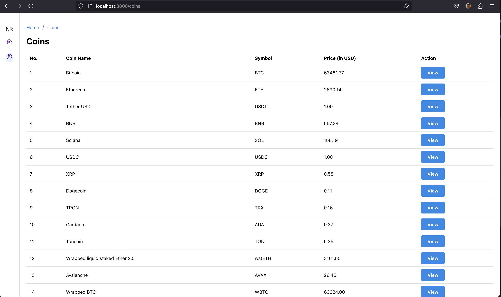
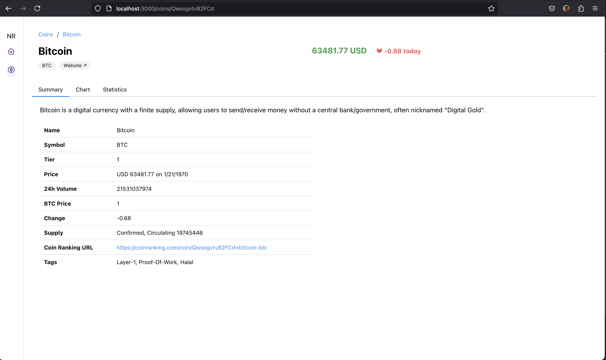
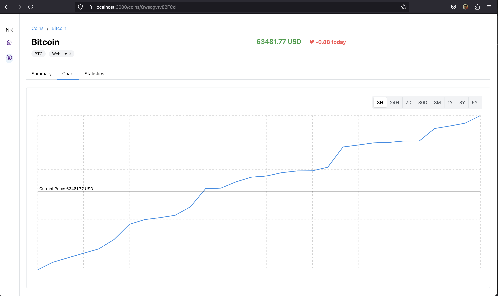
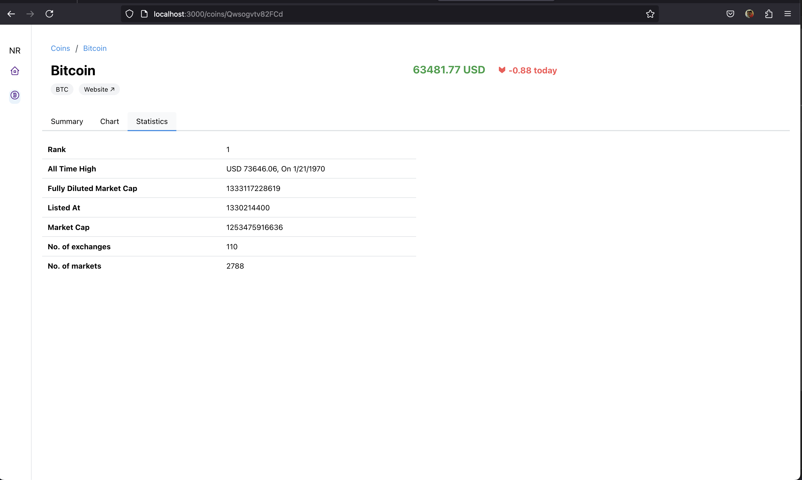

# Frontend Assignment - Catalog

## Images

## Packages Used
1. [Mantine](https://mantine.dev/) - React component library which provided components, styles and the chart functionality. 
2. [Axios](https://axios-http.com/docs/intro) - To make API calls.
3. [Rapid API](https://rapidapi.com) - For Mock API data.